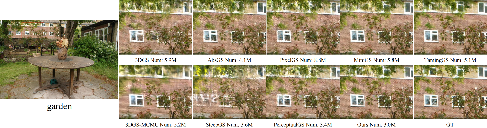
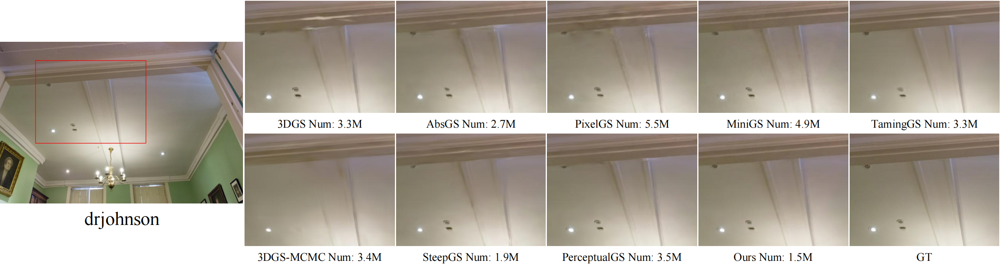
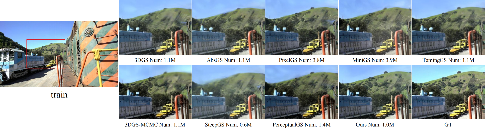
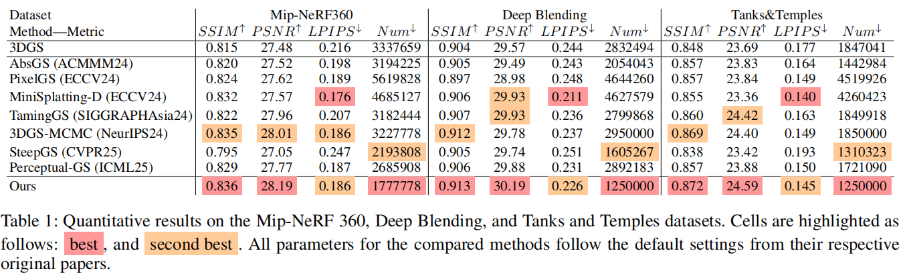

# Improving Densification in 3D Gaussian Splatting for High-Fidelity Rendering

### Xiaobin Deng, Changyu Diao, Min Li, Ruohan Yu, Duanqing Xu

### Zhejiang University

## [Paper](https://arxiv.org/pdf/2508.12313)| [arXiv](https://arxiv.org/abs/2508.12313)| [Project Page](https://xiaobin2001.github.io/improved-gs-web/)| [Trained Scenes 百度网盘](https://pan.baidu.com/s/1NL5jTkJnzwO2KdfMFSIbvg?pwd=pz67)|[Data 百度网盘](https://pan.baidu.com/s/1-qi3NE9CZKp8JPX6Y2ba_Q?pwd=45t2)  

In this work, we present a comprehensive improvement to the densification pipeline of 3DGS from three perspectives: when to densify, how to densify, and how to mitigate overfitting. Specifically, we propose an Edge-Aware Score to effectively select candidate Gaussians for splitting. We further introduce a Long-Axis Split strategy that reduces geometric distortions introduced by clone and split operations. To address overfitting, we design a set of techniques, including Recovery-Aware Pruning, Multi-step Update, and Growth Control. Our method enhances rendering fidelity without introducing additional training or inference overhead, achieving state-of-the-art performance with fewer Gaussians.

## News
11.21
We propose a high-quality pruning technique that requires no additional parameters and is learnable. The code has been open-sourced! [GNS](https://xiaobin2001.github.io/GNS-web/)

We have updated the CUDA kernel by adding the Compact Box proposed by Speedy Splat, which accelerates training by approximately 15%.

```
unzip submodules-speedy.zip
```

## Qualitative Result







## Quantitative Result



## Environment

Before installing our project, you need to ensure that your local environment for compiling the 3DGS CUDA kernel is properly set up, such as having CUDA Toolkit and Visual Studio installed. We recommend that you first install and run the [original 3DGS repository](https://github.com/graphdeco-inria/gaussian-splatting), and then proceed to install our project upon successful setup.

## Installation

Clone the repository

```
git clone https://github.com/aiirudi/ConfGS-cudas.git
```

Use the checked-in `submodules/` sources. Extracting an older submodule archive over them would replace the CUDA Conf rasterizer.

Then, you can install the dependencies listed in `environment.yml` following the installation instructions of 3DGS. 

If you are already familiar with installing various 3DGS-based improvements, you may choose to manually install the required libraries. However, please note the following:  

- Ensure that your `pip` version is not too high, otherwise the CUDA kernels in the submodules may fail to install properly.  
- The `numpy` version should be 1.x.x. Sometimes, the default installation may result in `numpy` ≥ 2.0, which you will need to manually downgrade.

## Running

The `budget.txt` file provides the budget parameters we used across various scenes. The "small" version uses 40% of the normal budget, allowing our method to be successfully reproduced even on consumer-grade GPUs such as the RTX 3060. Notably, the performance of the small version still surpasses that of the original 3DGS.

`test.py` provides a simple script to run evaluations in batch mode under the Windows environment.

To use this script, you need to create a `data` folder and organize the required 13 scenes in the following structure:

```
data
├── bicycle
│   ├── images
│   └── sparse
├── flowers
├── ...
```

You can also run the code in the same way as 3DGS.

### CUDA Conf densification

Rebuild the local rasterizer after updating this checkout:

```bash
python -m pip install -v --no-build-isolation -e submodules/diff-gaussian-rasterization
```

The CUDA extension source is `submodules/diff-gaussian-rasterization/`. The current CUDA Conf build was validated with PyTorch 2.1.2 and CUDA 11.8 in the `pytorch/pytorch:2.1.2-cuda11.8-cudnn8-devel` image; the repository's older `environment.yml`/Dockerfile pins are retained for existing deployments and may require their own compatibility check.

For GPU-less Docker builds, the Dockerfile defaults to `TORCH_CUDA_ARCH_LIST=8.0+PTX` (A100 and compatible later GPUs). Override it with `docker build --build-arg TORCH_CUDA_ARCH_LIST="..."` for a different target architecture.

Training now uses `conf_only` by default. A Gaussian is eligible for LAS when its CUDA Conf score reaches `--conf_thr`, its norm sum is positive, and it has at least `--conf_min_views` distinct visible training cameras in its recent-view window. The default `--conf_window_size` is 3; choose `2 <= conf_min_views <= conf_window_size`. The existing EAS and RFAS computations and their fused ranking score still determine which eligible Gaussian is sampled first. Legacy candidate strategies (`and`, `or`, `abs_only`, `weighted_score`, `soft_fusion`, `rfas_rank`) raise an explicit error in the CUDA Conf training path because they depend on or bypass the new gate; use `--candidate_selection_strategy conf_only`. For fixed candidate budgets, choose `fixed_number` or `fixed_ratio`; `match_and` depends on the removed abs-gradient gate.

Each Gaussian retains its most recent distinct cameras that actually contributed pixels. A visible zero-gradient observation occupies a slot; an invisible or invalid observation leaves that Gaussian's history unchanged. Revisiting a camera refreshes its slot, and a new camera evicts the oldest slot when the window is full. Histories persist across densification intervals and follow surviving Gaussians through pruning; new split rows start empty. Observations still come from different training steps, so the window is not a frozen-model comparison. At window size 3, the resident state uses about 96 bytes per Gaussian, plus a transient 16-byte sample when collection is enabled. CUDA Conf is a detached density statistic; optimization still uses the real loss gradients. The rasterizer currently requires the CUDA default stream; its Python wrapper reports an error on another stream.

## Parameters

`SparseAdam` : `SparseAdam` is equivalent to enabling, from the beginning, a multi-resolution update (MU) strategy applied only to the SH coefficients at an interval of 16. While this can significantly improve training speed, it also has a notable negative impact on rendering quality. Therefore, we keep `SparseAdam` disabled by default.

 `data_device` : Replacing  `data_device` with "cpu" can save GPU memory, especially in cases with a large number of viewpoints. Users with less than 12GB of GPU memory are recommended to use this option.

## Scene Visualization

Our work does not introduce additional parameters to the Gaussian ellipsoids, which means you can use any 3DGS viewer to visualize the trained scenes. We recommend [SuperSplat](https://superspl.at/editor) as a viewer.

## Citation

This project is the official implementation of **Improving Densification in 3D Gaussian Splatting for High-Fidelity Rendering**. It is important to note that this paper is a resubmission of **Efficient Density Control for 3D Gaussian Splatting**, with significant changes in methodology and writing. The original version has been deprecated and is no longer maintained. The original EDC code repository is also no longer updated or accepting inquiries.

Bibtex
```
@misc{deng2025improvingdensification3dgaussian,
      title={Improving Densification in 3D Gaussian Splatting for High-Fidelity Rendering}, 
      author={Xiaobin Deng and Changyu Diao and Min Li and Ruohan Yu and Duanqing Xu},
      year={2025},
      eprint={2508.12313},
      archivePrefix={arXiv},
      primaryClass={cs.CV},
      url={https://arxiv.org/abs/2508.12313}, 
}
```

## Acknowledgments

This project is built upon the open-source code of [TamingGS](https://github.com/humansensinglab/taming-3dgs). We sincerely thank the authors for their excellent work.
